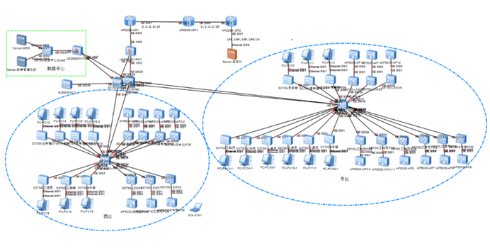

# Computer_Networks_Course_Design
 计算机网络课程设计——xx学校组网方案

- 网络拓扑结构：根据需求分析，设计了一个分层的网络结构，包括核心层、汇聚层和接入层，以及数据中心区域和无线网络区域。网络拓扑结构图如下：  

- 设备选择和配置：根据不同层次的功能需求，选择了合适的设备类型和型号，并进行了相应的配置，包括端口模式、VLAN、链路聚合、三层路由协议、防火墙规则、无线控制器设置等。  
- IP地址规划：根据网络规模和用户数量，采用了子网划分的方法，对不同的区域和设备分配了合理的IP地址段和掩码，以实现网络互联和管理。部分IP地址规划表如下：  

| **名称** | **接口**           | **IP**           | **名称** | **接口** | **IP**           |
| -------- | ------------------ | ---------------- | -------- | -------- | ---------------- |
| Core3    | GE0/0/24(VLAN200） | 172.16.200.1/30  | FW2      | GE1/0/0  | 172.16.200.2/30  |
| AR1      | GE0/0/0            | 172.16.200.5/30  | FW1      | GE1/0/0  | 172.16.200.6/30  |
| FW1      | GE1/0/1            | 172.16.200.9/30  | Core1    | GE0/0/24 | 172.16.200.10/30 |
| FW1      | GE1/0/2            | 172.16.200.13/30 | Core2    | GE0/0/24 | 172.16.200.14/30 |
| Core1    | GE0/0/23(VLAN201） | 172.16.200.17/30 | FW2      | GE1/0/1  | 172.16.200.18/30 |
| Core2    | GE0/0/23(VLAN201） | 172.16.200.21/30 | FW2      | GE1/0/2  | 172.16.200.22/30 |

  **设计内容：**  设计一个适用于山西工学院的校园网络，实现数据中心、无线网络和互联网的互联和访问，满足教学、科研、管理等不同用户的需求。  

**设计要求：** 

-  网络拓扑结构要求：采用分层的网络结构，包括核心层、汇聚层和接入层，以及数据中心区域和无线网络区域。核心层负责连接数据中心、无线控制器和互联网，提供高速的数据转发；汇聚层负责连接核心层和接入层，提供链路聚合和路由功能；接入层负责连接汇聚层和终端用户，提供端口接入和安全功能。数据中心区域负责存储和处理各种应用数据，提供服务器访问服务；无线网络区域负责提供无线接入点，实现无线用户的接入和管理。 
- 设备选择和配置要求：根据不同层次的功能需求，选择合适的设备类型和型号，并进行相应的配置。核心层使用高性能的路由器和交换机，配置三层路由协议，如OSPF、BGP等；汇聚层使用支持链路聚合的交换机，配置LACP技术，增加链路带宽和冗余性；接入层使用支持端口模式和安全特性的交换机，配置端口接入模式，如Frame Mode MPLS、Access、Trunk等，配置VLAN网络进行用户分组，配置端口安全特性，如802.1x认证、端口安全等。数据中心区域使用防火墙设备，配置访问控制列表（ACL）、网络地址转换（NAT）以及动态主机配置协议（DHCP）等功能，保护数据中心的安全和稳定；无线网络区域使用无线控制器设备，配置基于控制器的集中式无线网络，包括无线接入点的数量和部署位置，无线热点的设置等。  
- IP地址规划要求：根据网络规模和用户数量，采用子网划分的方法，对不同的区域和设备分配合理的IP地址段和掩码，以实现网络互联和管理。IP地址规划要考虑网络的简洁性、有效性和灵活性，尽量避免地址浪费和重复，正确表示网络的逻辑结构，方便进行路由选择和转发，适应网络的变化。  
